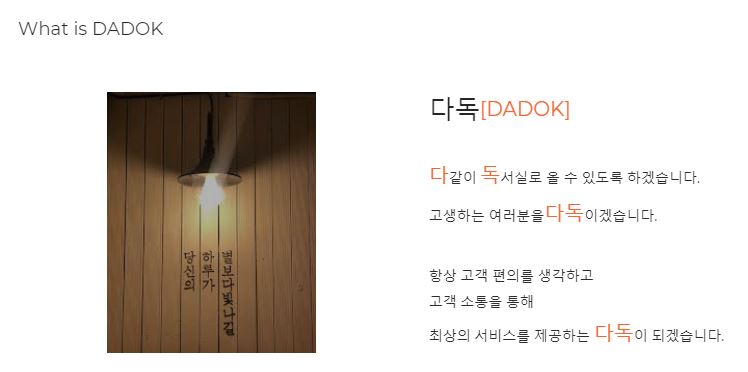
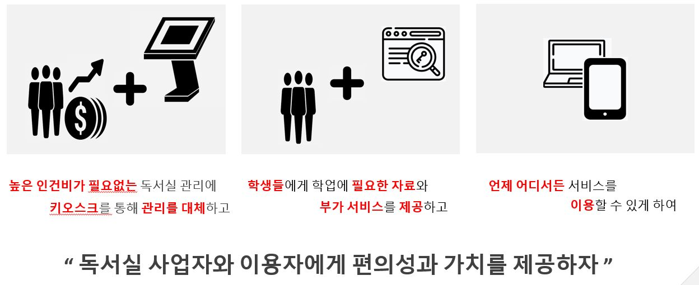
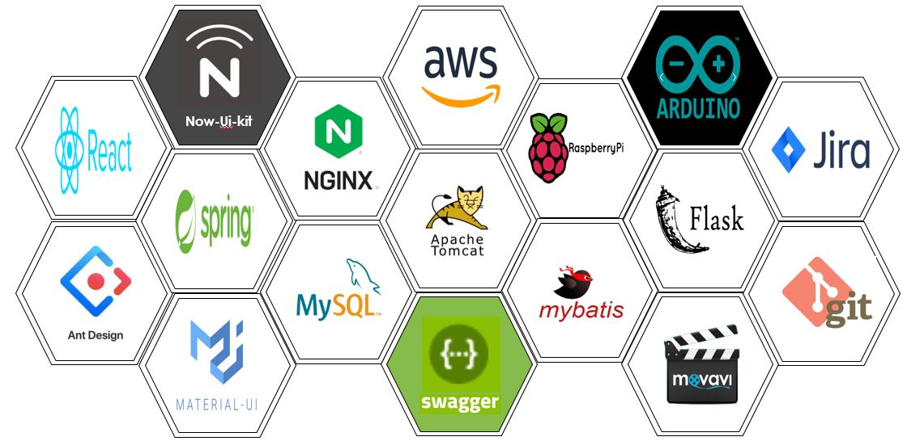
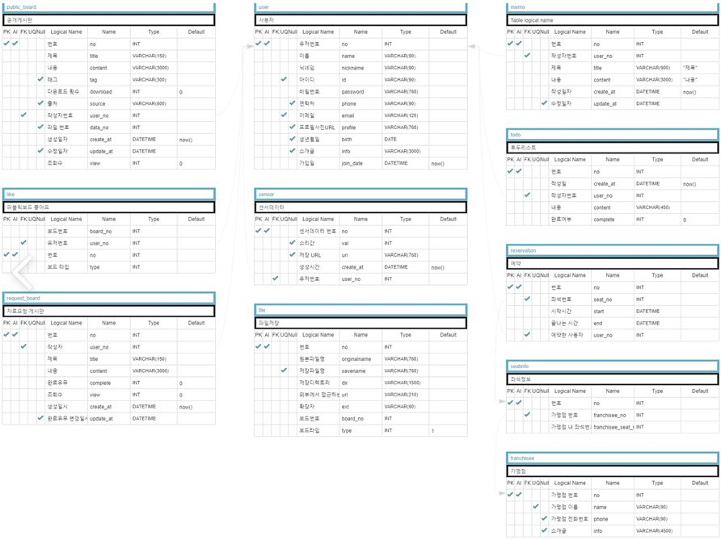
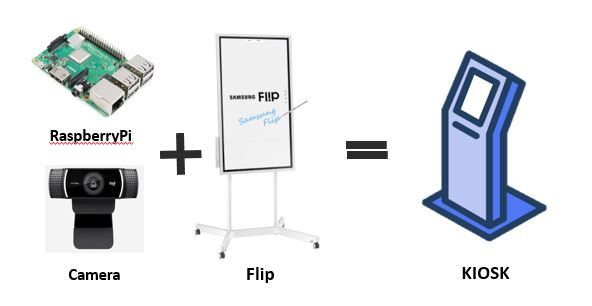
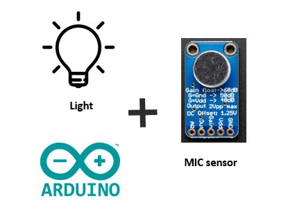
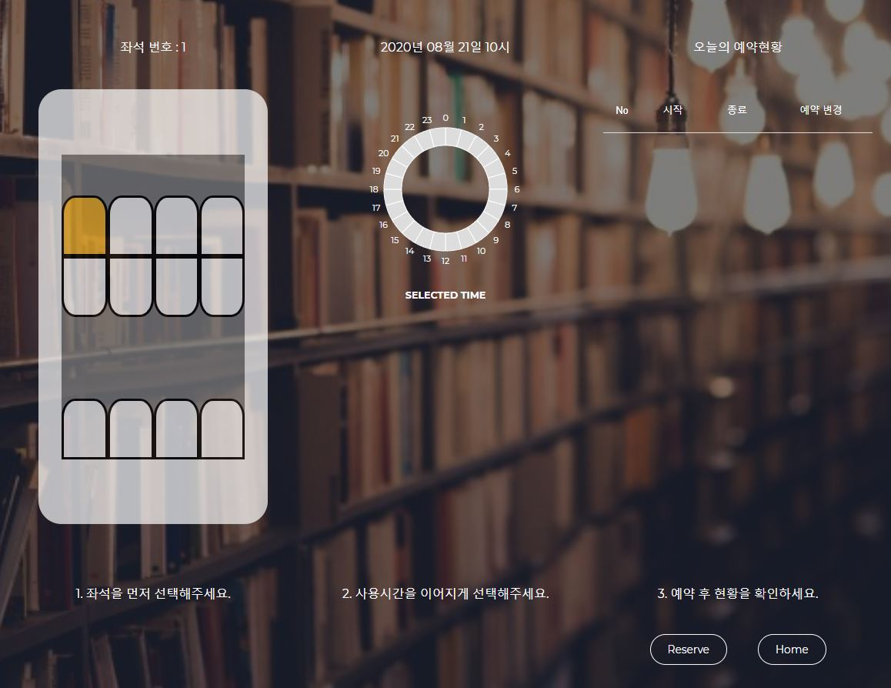
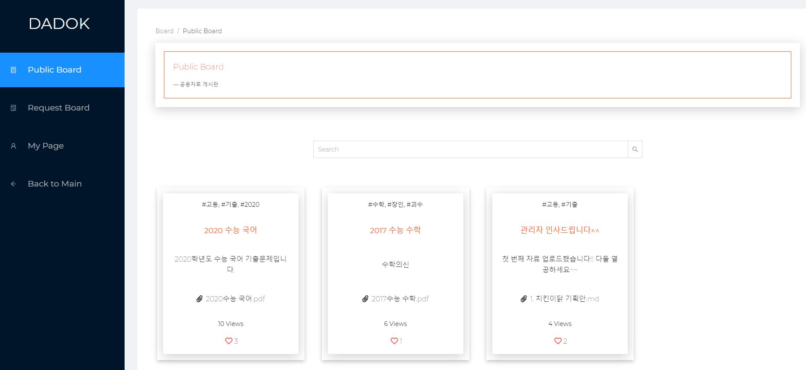
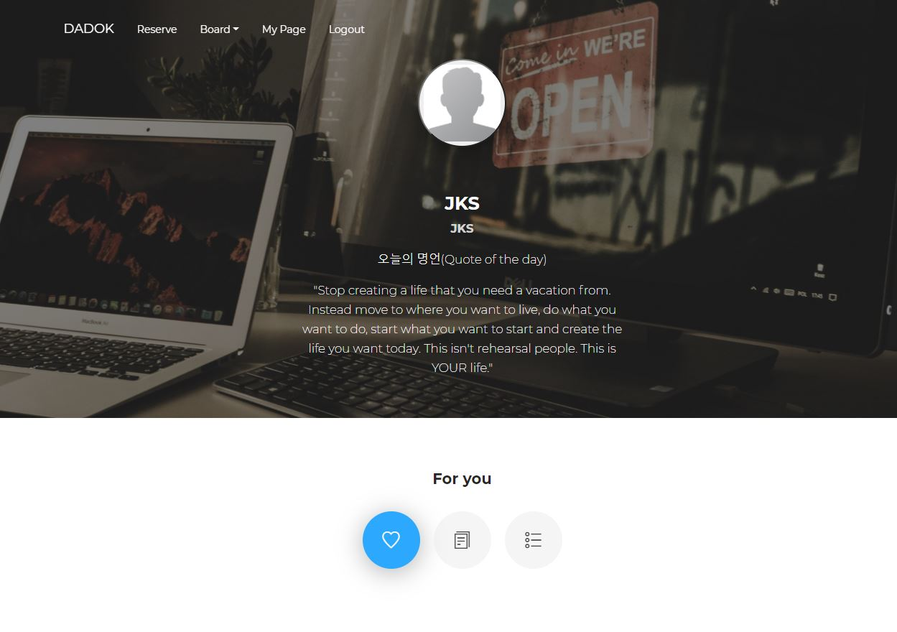

# DADOK Project

##### 1. 프로젝트 이름 : DADOK

​	

##### 2. 참여자 : 박강민, 박태문, 배병준, 정광수, 진승화

##### 3. 프로젝트 목적 

- 최저임금 인상으로 독서실 관리에 어려움을 겪고 있는 사업주에게 키오스크를 활용 예약 진행

- 웹 사이트를 통해 사용자에게 예약 진행과 학습에 필요한 자료 및 부가서비스를 제공

- 뚜렷한 프랜차이가 떠오르지 않는 독서실 시장에 독서실 사업주와 사용자 모두에게 유용한 서비스를 제공하여

  독서실 시장에 좋은 아이템 소스가 되고자 함.

##### 4. 개발 기간 :  2020.07.13 ~ 2020.08.21 (ver.1 )

##### 5. 개발 기술 

##### 6. Project ERD

##### 7. 세부기능

- Embedded System

  - Kiosk를 통한 예약 시스템

    - 독서실의 예약 서비스를 Kiosk를 활용하여 무인 서비스 진행.

    - 프로필 사진을 등록한 회원의 경우 안면인식 로그인 진행. 

      

    - ver.1 에서는 회원, 비회원 유무에 따라 인증 및 좌석 예약 진행까지 기능 구현

  - 소음 감지 시스템

    - 독서실을 사용하는 이용자 중 소음을 발생하는 이용자에게 소음 유무를 인지시켜 

      쾌적한 독서실 환경을 구축하고자 함

      

    - ver.1에서는 약 70db이상의 크기의 소음이 4번 연달아 발생할 때 빨간불이 작동하게 구현

      70db미만의 소리가 10초 유지 됐을 때, 빨간 불이 꺼짐.

- Web Service

  - 예약 service

    - 회원의 경우 온라인에서 예약이 가능하도록 시스템 구축

      

    - ver.1 에서는 12개의 좌석에 대해 원하는 시간을 선택하면 예약이 진행되도록 구축

  - 게시판 service

    - 학업에 필요한 자료를 제공 및 요청 가능

    - 회원의 경우 좋아요를 통해 관리 가능하며 첨부되어 있는 파일을 다운로드 가능

      

    - ver.1에서는 관리자만 게시물을 등록 가능.

  - Mypage service

    - 회원의 경우 좋아요한 게시물 관리, 메모장 기능, 오늘의 할 일 작성 가능

      